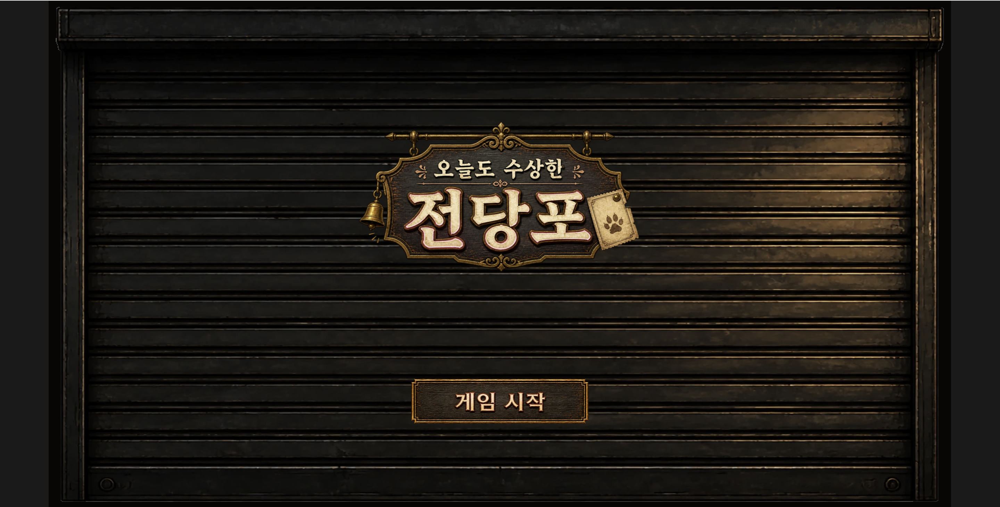
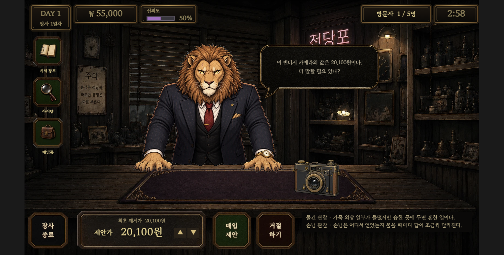
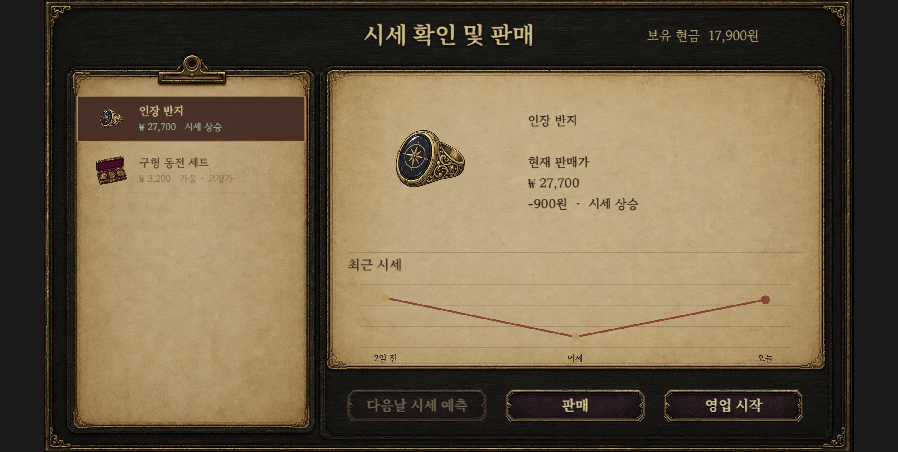
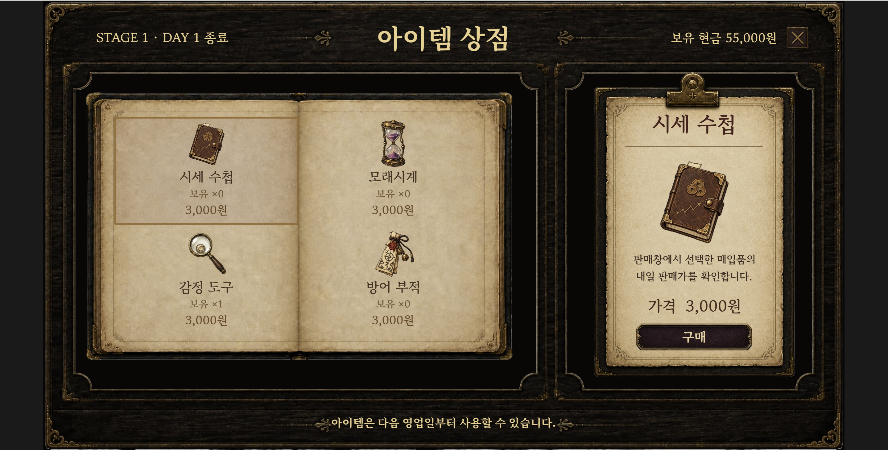
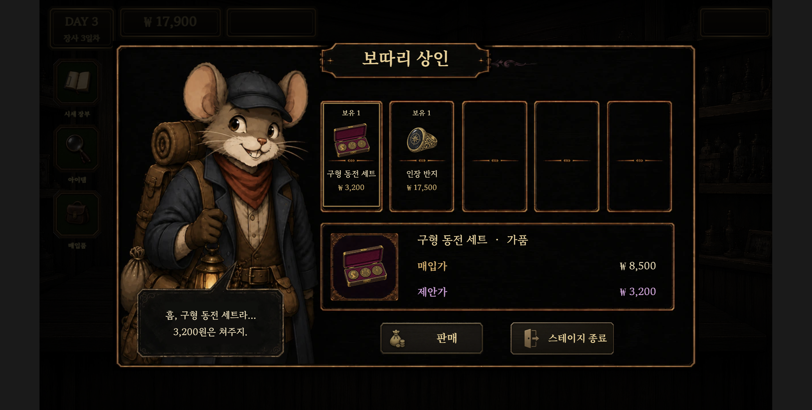
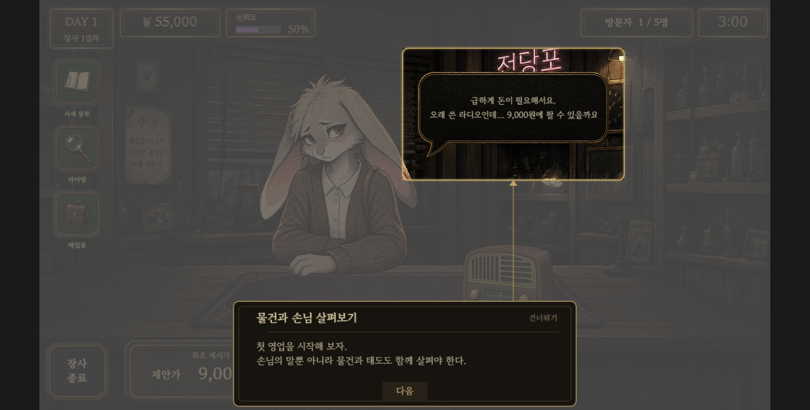
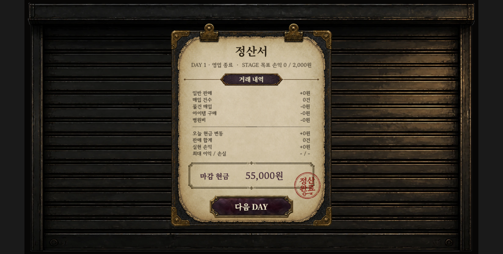

# 오늘도 수상한 전당포

> 손님의 말과 물건 속 단서를 살피고, 흥정과 판매로 월세를 마련하는 전당포 경영 게임

[게임 플레이하기](https://suspicious-pawnshop.pages.dev/)



## 프로젝트 소개

OpenAI가 서울에서 처음 개최한 Codex 게임 해커톤에 참가해 만든 웹 게임입니다.
기획을 포함한 전체 기간은 3주였지만 실제 코드 작업에 사용할 수 있는 시간은 9일이었고,
제한된 기간 안에 STAGE 1~2의 완결된 플레이 경험을 만드는 것을 목표로 했습니다.

플레이어는 손님의 말과 태도, 물건의 상태를 근거로 진품과 가품을 판단합니다. 가격을
흥정해 물건을 매입하고, 변동하는 시세에 맞춰 판매해 월세와 목표 수익을 달성해야 합니다.

| 구분 | 내용 |
| --- | --- |
| 개발 형태 | 2인 팀 프로젝트 |
| 담당 범위 | 게임 기획·아트 공동 작업, 개발·AI 워크플로·테스트·배포 전반 담당 |
| 개발 환경 | Phaser 4.2.1, TypeScript, Vite, Vitest |
| 플랫폼 | Web |

## 실제 플레이 화면

| 거래와 흥정 | 시세 확인과 판매 |
| --- | --- |
|  |  |

| 아이템 상점 | 보따리 상인 |
| --- | --- |
|  |  |

<details>
<summary>튜토리얼과 일일 정산 화면 보기</summary>

| 튜토리얼 | 일일 정산 |
| --- | --- |
|  |  |

</details>

## 핵심 플레이

- 물건과 손님의 대사에서 단서를 찾아 진품과 가품을 판단합니다.
- 최대 3차례 가격을 제안하며 흥정하고, 손님 성격과 신뢰도 변화를 관리합니다.
- 매입한 물건을 변동 시세에 판매해 월세와 STAGE 목표 수익을 마련합니다.
- 감정 도구, 시세 수첩, 모래시계, 방어 부적을 상황에 맞게 사용합니다.
- 튜토리얼부터 시장 판매, 일일 정산, 보따리 상인, STAGE 결과까지 하나의 루프로
  이어집니다.

## AI를 활용한 개발 방식

가장 큰 문제는 사실상 혼자 감당해야 하는 작업량을 9일 안에 완성하는 것이었습니다.
Codex에게 단순히 코드를 요청하는 대신, **같은 기획을 공유하고 작은 구현 단위를 반복해서
완료하는 협업 구조**를 만들었습니다.

1. Notion에 게임 규칙, 화면 구성과 거래 방식을 상세히 정리해 Codex가 항상 같은 기획을
   기준으로 작업하도록 했습니다.
2. 기획을 독립적으로 구현·검증할 수 있는 PRD로 나누고 하나씩 맡겼습니다.
3. 구현 결과는 직접 실행하고 플레이하며 확인했습니다. UI 겹침이나 클릭 위치처럼 자동
   테스트가 판단하기 어려운 문제는 실제 화면을 기준으로 반복 수정했습니다.
4. 기획이 바뀌면 이유와 영향 범위를 문서에 남겨 대화에서 나온 결정이 코드에만 숨지
   않도록 했습니다.
5. 테스트, 타입 검사, 빌드와 브라우저 실행을 반복해 AI가 만든 결과를 검증했습니다.

```text
기획·판단: 본인 + 팀원
      ↓
PRD와 작업 지시: 사용자 + Codex
      ↓
구현 → 테스트 → 실패 분석 → 수정: AI 에이전트
      ↓
실행 화면 확인·플레이테스트·최종 결정: 본인
```

무엇을 만들고 어떤 경험을 핵심 재미로 삼을지는 직접 결정했습니다. 운으로 정답을 맞히는
대신 단서를 통해 판단하고 그 결과를 확인하는 구조, 손님별 성격과 신뢰도, 흥정 폭과
가품 위험도 같은 난이도 요소도 직접 플레이한 뒤 최종 조정했습니다.

## 문제 해결 — 원인 불명 진행 멈춤

게임이 간헐적으로 다음 날로 넘어가지 않는 문제가 있었습니다. 증상만 우회하지 않고
Codex와 함께 재현 조건을 좁히며 가설을 하나씩 검증했습니다.

첫 번째 원인은 개발자 메뉴로 지급한 테스트 자금이었습니다. 하루가 끝날 때 장부는
`시작 잔고 + 당일 손익 = 현재 잔고`인지 검사했지만, 테스트 자금은 장사 수익이 아니어서
검증이 실패했습니다. 해당 금액을 장부 검사에서 분리했지만 같은 증상이 다시 나타났습니다.

두 번째 원인은 영업 시작 시 시작 잔고를 다시 기록하는 코드였습니다. 개장 전에 판매한
매출이 하루 손익에서 빠지면서 같은 오류가 발생했습니다. 잔고를 덮어쓰는 코드를 제거하고
동일한 상황을 자동 검사에 추가해 재발을 막았습니다.

이 과정에서 **증상이 사라진 것과 원인이 해결된 것은 다르며, 같은 증상 뒤에 여러 원인이
있을 수 있다**는 점을 배웠습니다. 이후 원인 불명 버그는 증상, 재현 조건과 의심 가설을
함께 제시하고 검증 결과에 따라 다음 가설로 넘어가는 방식으로 해결했습니다.

## 개발 원칙과 회고

- AI는 구현과 분석을 가속하는 협업 도구로 사용했습니다.
- 생성 결과를 그대로 채택하지 않고 코드 검사, 자동 테스트와 직접 플레이로 검증했습니다.
- 반복 작업과 초안은 AI에 맡기고, 확보한 시간은 게임의 방향과 사용자 경험을 판단하는 데
  사용했습니다.
- AI가 만든 결과를 비판적으로 검토하고 최종 판단에 책임지는 것은 사람의 역할이라고
  생각합니다.

핵심 로직을 보호하는 테스트 198개를 전부 통과한 상태로 완성했으며, PRD와 변경 이력은
[`docs/prd/`](docs/prd/)와 [`docs/design-change-log.md`](docs/design-change-log.md)에서
확인할 수 있습니다.

## 로컬 실행

Node.js 22 환경을 권장합니다.

```bash
npm install
npm run dev
```

```bash
npm test
npm run typecheck
npm run build
```

배포와 에셋 최적화 절차는 [`docs/deploy.md`](docs/deploy.md), 오디오 출처와 라이선스는
[`docs/audio-credits.md`](docs/audio-credits.md)에서 확인할 수 있습니다.
